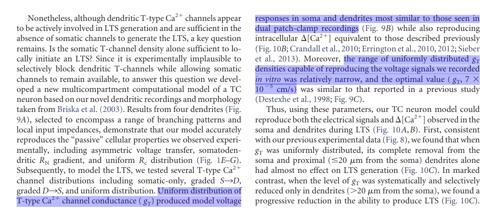

# NeuroCurator's Annotation Viewer

View text annotations directly on a PDF.

The Annotation Viewer displays the text annotations made with
[NeuroCurator](https://github.com/BlueBrain/neurocurator).
It can also load and display the annotations made on and exported from the
[OpenMinTeD platform](https://services.openminted.eu) (see the tutorial
here (to be published)).

No interaction is **currently** possible with the Annotation Viewer. This implies:
- text cannot be selected, but the default OS PDF Reader is still launched,
- scale factor ('zoom') is hard coded, it should be adapted to the screen
[here](https://github.com/BlueBrain/neurocurator/blob/annotation_viewer/neurocurator/annotation_viewer.py#L431).

---

## Screenshot

Two multiline annotations visualized with one also being multicolumn: 



([Research article](https://doi.org/10.1523/JNEUROSCI.2740-15.2015) under
[CC-BY 4.0](https://creativecommons.org/licenses/by/4.0/), unmodified text from
page 15517 with
[annotations from NeuroCurator](https://github.com/BlueBrain/corpus-thalamus/blob/9caa37430a882f4cb94df293c512a05d49950286/10.1523%252FJNEUROSCI.2740-15.2015.pcr)
highlighted)

## Getting Started

Due to technical aspects, the Annotation Viewer has **not the same
requirements as NeuroCurator**.

### Requirements

- [NeuroCurator v0.4.2 - Annotation Viewer edition](https://github.com/BlueBrain/neurocurator/tree/annotation_viewer)
- [Python 3.6+](https://www.python.org/downloads/)
- [Qt 5.10+](https://www.qt.io/download-qt-installer)
- [PyQt 5.10+](https://www.riverbankcomputing.com/software/pyqt/download5)
- [Poppler 0.64+](https://poppler.freedesktop.org/) with Qt 5
- [python-poppler-qt5](https://github.com/wbsoft/python-poppler-qt5)
- [fuzzysearch](https://pypi.org/project/fuzzysearch/)

### A - Installation - NeuroCurator

For details, see the [Getting Started](README.md#getting-started) of NeuroCurator.

```bash
conda create --name nc python=3.4
```

```bash
conda activate nc
```

```bash
conda install pyside --channel conda-forge
```

```bash
conda install beautifulsoup4 gitpython lxml numpy pandas scipy
```

```bash
pip install parse pyzotero quantities wand
```

```bash
pip install nat==0.4.2 --no-deps
```

```bash
git clone -b annotation_viewer https://github.com/BlueBrain/neurocurator.git
```

Adapt line 938 in neurocurator/annotation_viewer.py the path (`"/usr/local/bin/python3"`)
to the Python 3 environment installed below.

```bash
cd neurocurator
pandoc --from=markdown --to=rst README.md -o README.rst
pip install . --no-deps
```

### B - Installation - Annotation Viewer

**Common instructions**

```bash
pip install fuzzysearch
```

**Instructions for Ubuntu 16.04+**

```bash
sudo apt install python3-poppler-qt5
```

**Instructions for macOS 10.13+**

We will use [Homebrew](https://brew.sh) to simplify the installations.

1 - Python - https://formulae.brew.sh/formula/python

```bash
brew install python
```

2 - GCC - https://formulae.brew.sh/formula/gcc

```bash
brew install gcc

# Adapt to your GCC version.
alias gcc=gcc-7
```

3 - Qt - https://formulae.brew.sh/formula/qt

```bash
brew install qt

export PATH="/usr/local/opt/qt/bin:$PATH"
```

4 - PyQt - https://formulae.brew.sh/formula/pyqt

```bash
brew install pyqt --without-python@2

# Adapt to your PyQt version.
ln -s /usr/local/Cellar/pyqt/5.10.1/share/sip/Qt5 /usr/local/share/sip/PyQt5
```

5 - Poppler - https://formulae.brew.sh/formula/poppler

```bash
brew install poppler --with-qt
```

6 - python-poppler-qt5 - https://github.com/wbsoft/python-poppler-qt5

```bash
git clone https://github.com/wbsoft/python-poppler-qt5

cd python-poppler-qt5

git pull origin pull/19/head
git pull origin pull/21/head

# Adapt to your Poppler version.
/usr/local/bin/python3 setup.py build_ext --poppler-version=0.64.0
/usr/local/bin/python3 setup.py install
```

**Test if successful**

This command should return without errors:

```bash
/usr/local/bin/python3 -c "import popplerqt5"
```

### C - Use

In neurocurator/neurocurator:

```bash
python3 -m neurocurator
```
